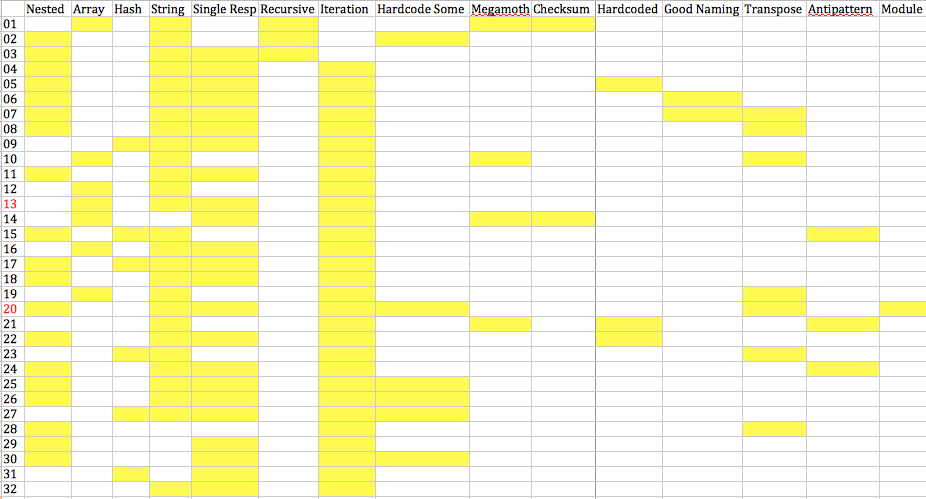

### sudoku solution review for students

this repo includes 100 solutions (both complete and partial) to the sudoku challenge

the solutions are grouped into 2 folders only to separate those included in the table below (`analyzed-solutions`) vs the others still to be reviewed (`solutions`)

all 100 solutions are worth reviewing if only to get a sense of what it feels like to read ~20,000 lines of code :)

it's exhausting.

so, if you want to find a solution that demonstrates something in particular, look at the table below and match the solution id (left column) to the file name in the folder `analyzed-solutions`

#### column headers

- Choice of Data Structure
  + **Nested**
    the solution uses some kind of nested data structure

  + **Array**
    the solution uses an `Array` as the primary data structure

  + **Hash**
    the solution uses a `Hash` as the primary data structure

  + **String**
    the solution uses a `String` as the primary data structure

- Patterns of Code
  + **Single Responsibility**
    the solution effectively demonstrates single responsibility

  + **Recursive**
    the solution uses a recursive approach

  + **Iterative**
    the solution uses an iterative approach

  + **Hardcode Some**
    *this column will be removed*

  + **Megamoth**
    the solution includes on or more impossibly complicated methods

  + **Checksum**
    the solution uses a checksum to validate completeness for rows, columsn and boxes

  + **Hardcoded**
    the solution manually hardcodes something that could have been calculated

  + **Good Naming**
    the solution demonstrates good naming conventions

  + **Transpose**
    the solution uses the `Array#transpose` method
  
  + **Antipattern**
    the solution includes one or more antipatterns

  + **Module**
    the solution uses a module for namespacing
